# TCM-KGQA-RAG-AGENT-SYSTEM

基于大模型驱动的中医古籍知识图谱问答 Agent 系统。

> 对 700 本中医古籍约 1GB TXT 文件做结构化三元组抽取与数据挖掘，消耗约 **12 亿 Token**，构建可推理、可检索的中医知识图谱，并实现完整的长链推理问答链路。

---

## 系统架构总览

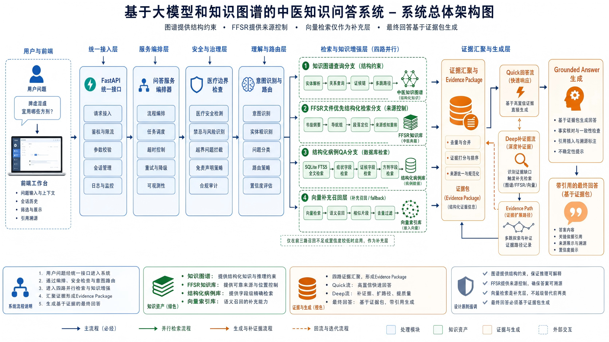

系统由 **主后端（8002）+ 图谱服务（8101）+ 检索服务（8102）** 三个独立进程构成。用户提问经意图分类器做实体识别和路由决策后，自动调度图谱检索、文件检索或两者融合，SSE 流式返回答案、证据卡片和推理链路。

---

## 前端界面

三栏 Agent 调试工作台——会话列表（左）、聊天面板与工具调用链（中）、文件编辑器（右）。

| 主界面与提问 | 图谱证据展示 |
|---|---|
| 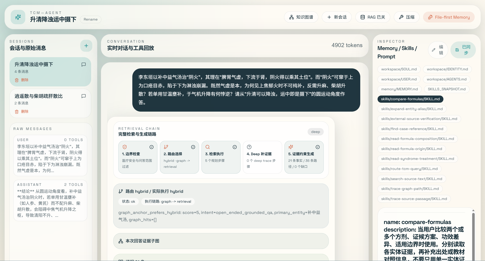 | 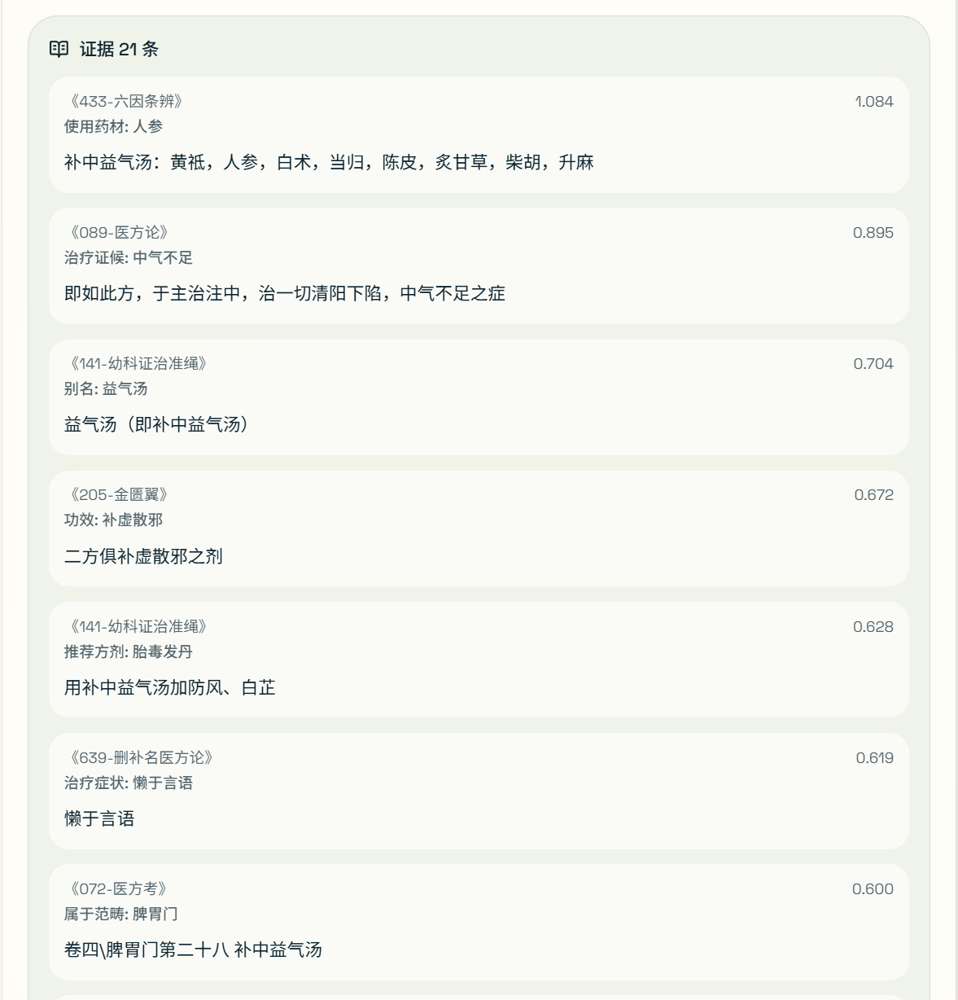 |

| Deep 模式推理追踪 | 最终答案与证据溯源 |
|---|---|
| 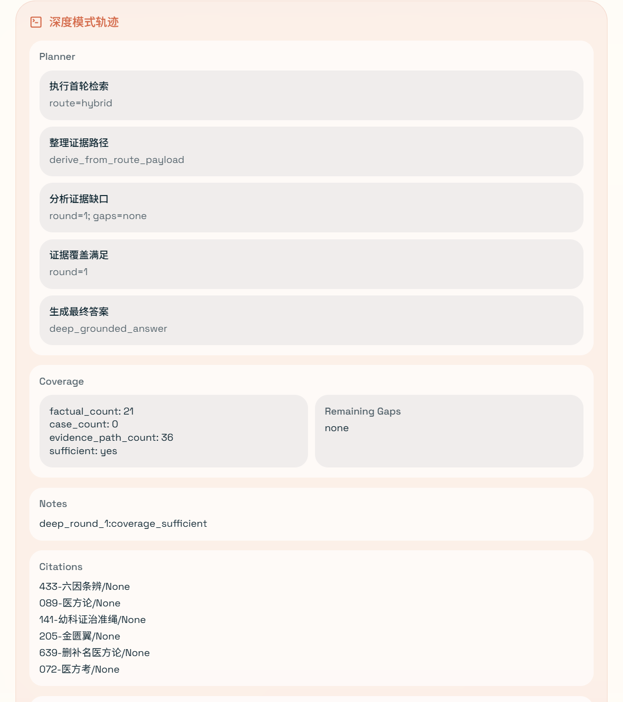 | 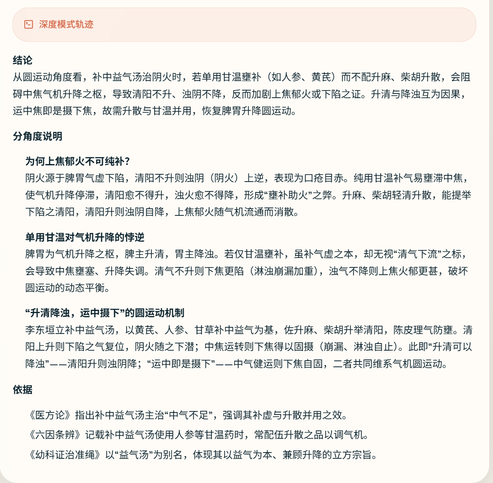 |

---

## 核心工作一：大规模古籍知识图谱构建

使用自研管道对 700 本中医古籍全文做结构化三元组抽取，形成可推理的知识网络。

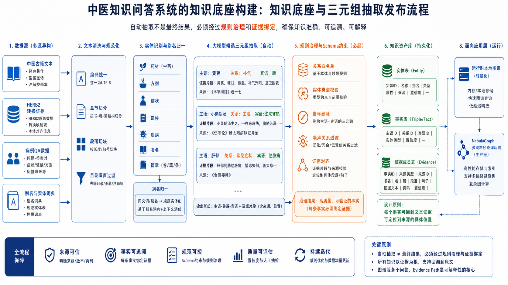

**三元组抽取过程：**
- 700 本古籍 TXT 文件（约 1GB）→ 分册分章切块 → 排除目录/序言等无信息章节
- chunk 送入 LLM → JSON 结构化三元组提取 → 多 provider 格式统一 coerce
- 去重 + 噪声过滤（非知识性文本）→ 运行时关系治理 → 发布为 `graph_runtime.json` + `graph_runtime.evidence.jsonl`
- **约 12 亿 Token** 消耗，带 chunk 级 checkpoint 断点续跑与失败自动重试队列

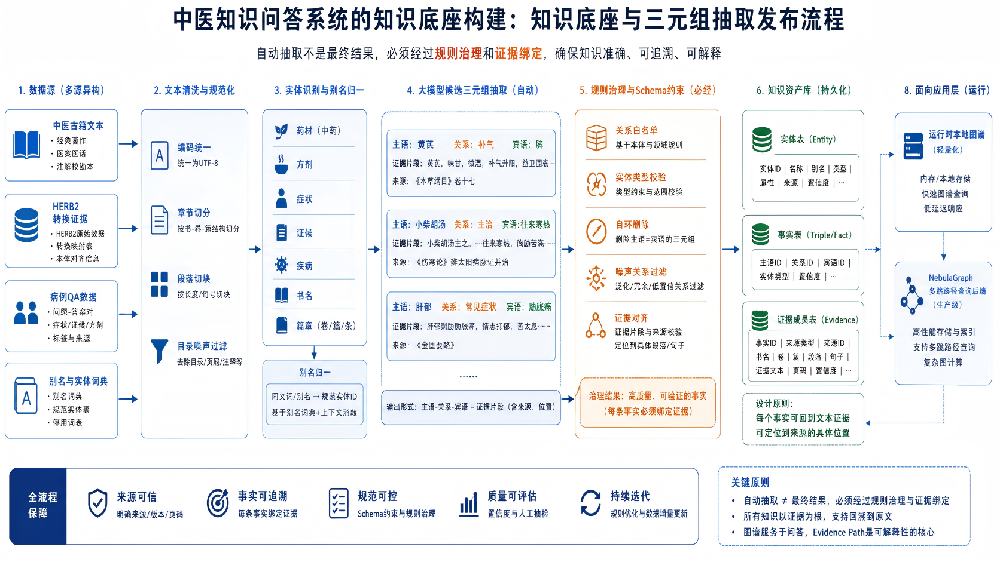

---

## 核心工作二：Files-First 非向量主检索链路

默认问答主链已收口为 "图谱 + files-first + 结构化索引"，摒弃传统纯 dense 向量检索的黑盒问题。

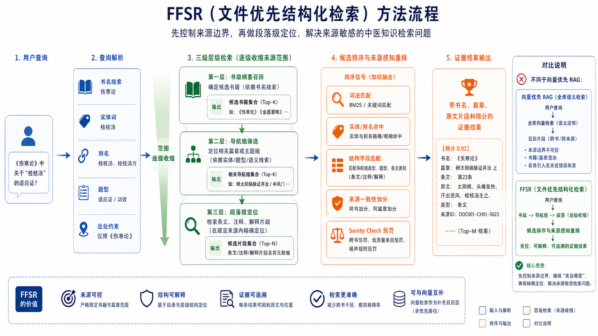

- 经典古籍 files-first 索引：预处理阶段建立文件级 FTS 检索与结构化索引
- 运行时按需走 `entity://` / `book://` / `chapter://` / `alias://` / `caseqa://` 证据路径
- dense 向量检索仅作为兼容 fallback，不再参与默认主路径

---

## 核心工作三：长链推理（Deep Mode）

系统支持 Quick 与 Deep 两种问答模式。Deep 模式是核心长链推理引擎——每轮由 LLM 规划器分析证据缺口后拆解下一步行动，覆盖率状态机持续评估。

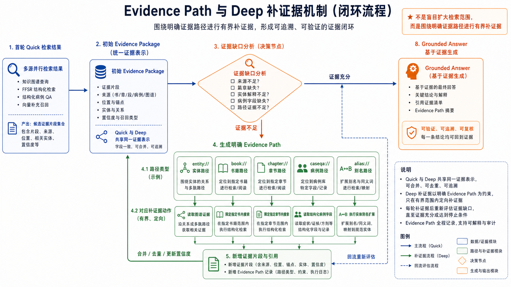

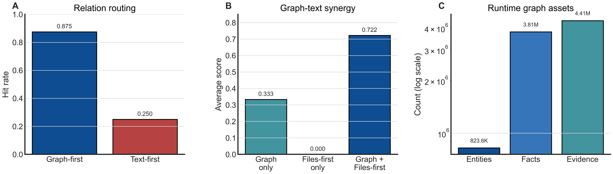

**推理流程：**
1. 用户提问 → 意图分类与实体识别 → 路由决策（graph / retrieval / hybrid）
2. Deep 模式最多 **4 轮迭代**，每轮最多 **2 个并行操作**
3. LLM 规划器生成行动 → 启发式回退规划器兜底 → 答案生成 **四层回退链**
4. 每步推理意图、新证据与覆盖率变化全部 SSE 流式输出并持久化

---

## 完整答案链

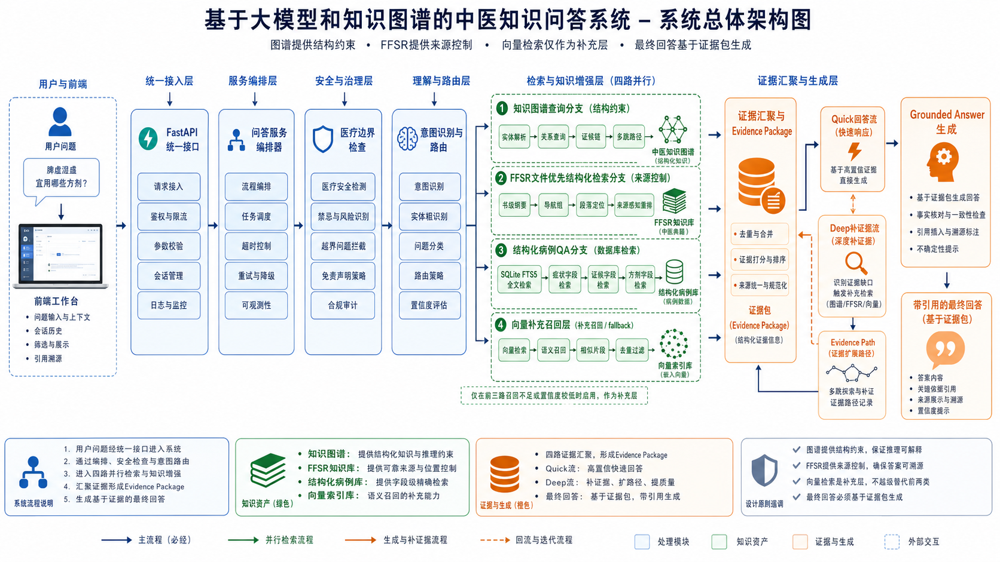

---

## 实验验证

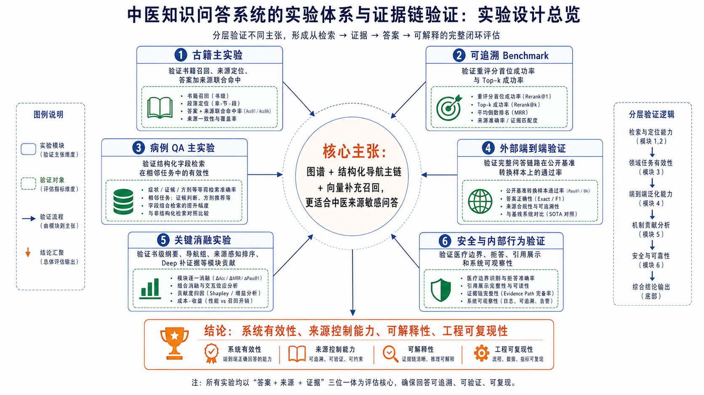

---

## 技术栈

**后端：** Python 3.10+ / FastAPI / LangChain 1.x `create_agent` / LlamaIndex / OpenAI-compatible API  
**前端：** Next.js 14 / React 18 / TypeScript / Tailwind CSS / Monaco Editor  
**数据：** NebulaGraph / Milvus / SQLite  
**模型支持：** MiniMax / 智谱 / 百炼 / DeepSeek / OpenAI

---

## 快速开始

### 环境要求
- Python 3.10+, Node.js 18+, npm

### 启动后端
```bash
cd backend
uv sync
cp .env.example .env   # 填入 API keys
uv run uvicorn app:app --host 0.0.0.0 --port 8002 --reload
```

### 启动前端
```bash
cd frontend
npm install
npm run dev
```
打开 http://localhost:3000

---

## 项目结构

```text
├── backend/
│   ├── api/                    # 聊天、会话、文件、配置接口
│   ├── services/
│   │   ├── qa_service/         # 问答编排、quick/deep 链路、证据包
│   │   ├── graph_service/      # 图谱实体查询、证候链、多跳路径
│   │   └── retrieval_service/  # files-first、结构化索引、向量兼容
│   ├── router/                 # 意图分类、路由决策、检索策略
│   ├── tools/                  # TCM 路由工具、证据导航工具
│   ├── graph/                  # Agent 编排、会话管理、记忆索引
│   ├── scripts/                # 三元组抽取控制台、图谱发布
│   └── eval/                   # 评测数据集、评测脚本、基线矩阵
└── frontend/
    └── src/
        ├── app/                # 页面入口
        ├── components/         # 三栏 UI、聊天、证据卡片、图谱可视化
        └── lib/                # API 客户端与状态管理
```

---

## 核心设计理念

**文件即记忆：** 长期记忆是 `memory/MEMORY.md`，会话是 `sessions/*.json`——索引只是可重建缓存。而非黑盒向量库。修改文件后下一轮请求立刻生效。

**可审计 Agent：** 前端可实时查看 tool start/end、Raw Messages、检索证据来源、路由决策原因——每一步推理都能被追溯和审计。

**优雅降级：** sidecar 不可用 → 回退本地引擎；图谱无命中 → 回退文本检索；LLM 生成失败 → 确定性文本拼接。每步降级都有标记和记录，不做静默切换。

---

## 相关资源

- 项目演示视频：[Bilibili](https://www.bilibili.com/video/BV1izcXz8EJx/)
- 详细开发进度：[docs/PROJECT_PROGRESS.md](docs/PROJECT_PROGRESS.md)
